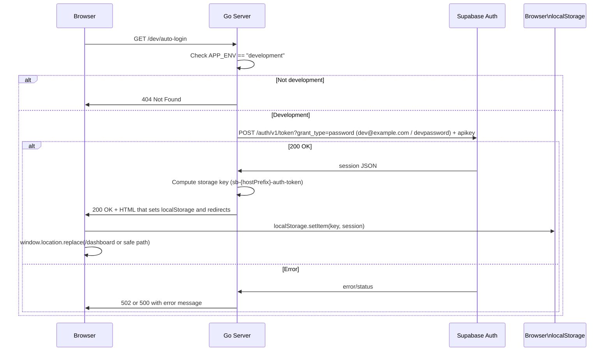

# PR Review Summary

**PR:** [#285 — Fix local dev setup and docs](https://github.com/Harvey-AU/hover/pull/285)
**Branch:** `work/mystifying-newton`
**Generated:** 2026-03-28 03:30 UTC

---

## CI Checks

| Check | Status |
|---|---|
| Coverage | ❓ Report |
| Deploy | ❓ Review |
| Format | ❓ Check |
| Integration | ❓ Tests |
| Lint | ✅ pass |
| Supabase | ❓ Preview |
| Unit | ❓ Tests |
| Validate | ❓ Changelog |
| Cleanup | ❓ Review |
| CodeRabbit | ✅ pass |

### Failed Job Logs

#### Run Tests

```
Lint	golangci-lint	2026-03-27T21:49:24.5127092Z   only-new-issues: false
Lint	golangci-lint	2026-03-27T21:49:24.5127194Z   skip-cache: false
Lint	golangci-lint	2026-03-27T21:49:24.5127303Z   skip-save-cache: false
Lint	golangci-lint	2026-03-27T21:49:24.5127402Z   problem-matchers: false
Lint	golangci-lint	2026-03-27T21:49:24.5127513Z   cache-invalidation-interval: 7
Lint	golangci-lint	2026-03-27T21:49:24.5127624Z env:
Lint	golangci-lint	2026-03-27T21:49:24.5127709Z   GOFLAGS: -mod=mod
Lint	golangci-lint	2026-03-27T21:49:24.5127819Z   GOPROXY: https://proxy.golang.org,direct
Lint	golangci-lint	2026-03-27T21:49:24.5127960Z   GITHUB_REPO_NAME: Harvey-AU/hover
Lint	golangci-lint	2026-03-27T21:49:24.5128073Z   GOTOOLCHAIN: local
Lint	golangci-lint	2026-03-27T21:49:24.5128170Z ##[endgroup]
Lint	golangci-lint	2026-03-27T21:49:24.6276445Z ##[group]prepare environment
Lint	golangci-lint	2026-03-27T21:49:24.6277328Z Checking for go.mod: go.mod
Lint	golangci-lint	2026-03-27T21:49:24.8820660Z Cache hit for: golangci-lint.cache-Linux-2934-2d9dc12e22e6f6e6cfbb6c0f003db1960b060cbc
Lint	golangci-lint	2026-03-27T21:49:24.9090443Z Received 646905 of 646905 (100.0%), 68.5 MBs/sec
Lint	golangci-lint	2026-03-27T21:49:24.9090802Z Cache Size: ~1 MB (646905 B)
Lint	golangci-lint	2026-03-27T21:49:24.9107750Z [command]/usr/bin/tar -xf /home/runner/_work/_temp/16fff700-2ad2-4d3f-a55f-b00afa972f9a/cache.tzst -P -C /home/runner/_work/hover/hover --use-compress-program unzstd
Lint	golangci-lint	2026-03-27T21:49:24.9669753Z Cache restored successfully
Lint	golangci-lint	2026-03-27T21:49:24.9676516Z Restored cache for golangci-lint from key 'golangci-lint.cache-Linux-2934-2d9dc12e22e6f6e6cfbb6c0f003db1960b060cbc' in 340ms
Lint	golangci-lint	2026-03-27T21:49:24.9678356Z Finding needed golangci-lint version...
Lint	golangci-lint	2026-03-27T21:49:24.9680234Z Installation mode: binary
Lint	golangci-lint	2026-03-27T21:49:24.9680714Z Installing golangci-lint binary v2.9.0...
Lint	golangci-lint	2026-03-27T21:49:24.9681195Z Downloading binary https://github.com/golangci/golangci-lint/releases/download/v2.9.0/golangci-lint-2.9.0-linux-amd64.tar.gz ...
Lint	golangci-lint	2026-03-27T21:49:25.4953220Z [command]/usr/bin/tar xz --overwrite --warning=no-unknown-keyword --overwrite -C /home/runner -f /home/runner/_work/_temp/91c9d7bc-570d-4436-b263-32f3a43133e3
Lint	golangci-lint	2026-03-27T21:49:25.6712290Z Installed golangci-lint into /home/runner/golangci-lint-2.9.0-linux-amd64/golangci-lint in 702ms
Lint	golangci-lint	2026-03-27T21:49:25.6712687Z Prepared env in 1044ms
Lint	golangci-lint	2026-03-27T21:49:25.6713116Z ##[endgroup]
Lint	golangci-lint	2026-03-27T21:49:25.6713303Z ##[group]run golangci-lint
Lint	golangci-lint	2026-03-27T21:49:25.6717714Z Running [/home/runner/golangci-lint-2.9.0-linux-amd64/golangci-lint config path] in [/home/runner/_work/hover/hover] ...
Lint	golangci-lint	2026-03-27T21:49:25.7301818Z Running [/home/runner/golangci-lint-2.9.0-linux-amd64/golangci-lint config verify] in [/home/runner/_work/hover/hover] ...
Lint	golangci-lint	2026-03-27T21:49:25.8542086Z Running [/home/runner/golangci-lint-2.9.0-linux-amd64/golangci-lint run  --config .golangci.yml --modules-download-mode=mod] in [/home/runner/_work/hover/hover] ...
Lint	golangci-lint	2026-03-27T21:49:27.8974851Z ##[error]internal/api/dev.go:84:13: Error return value of `fmt.Fprintf` is not checked (errcheck)
Lint	golangci-lint	2026-03-27T21:49:27.8980168Z 	fmt.Fprintf(w, `<!doctype html>
Lint	golangci-lint	2026-03-27T21:49:27.8980344Z 	           ^
Lint	golangci-lint	2026-03-27T21:49:27.8980482Z 1 issues:
Lint	golangci-lint	2026-03-27T21:49:27.8980568Z * errcheck: 1
Lint	golangci-lint	2026-03-27T21:49:27.8980633Z 
Lint	golangci-lint	2026-03-27T21:49:27.8986151Z ##[error]issues found
Lint	golangci-lint	2026-03-27T21:49:27.8986641Z Ran golangci-lint in 2041ms
Lint	golangci-lint	2026-03-27T21:49:27.8986886Z ##[endgroup]
```


---

## CodeRabbit Summary

> [!NOTE]
> ## Reviews paused
> 
> It looks like this branch is under active development. To avoid overwhelming you with review comments due to an influx of new commits, CodeRabbit has automatically paused this review. You can configure this behavior by changing the `reviews.auto_review.auto_pause_after_reviewed_commits` setting.
> 
> Use the following commands to manage reviews:
> - `@coderabbitai resume` to resume automatic reviews.
> - `@coderabbitai review` to trigger a single review.
> 
> Use the checkboxes below for quick actions:
> - [ ]  ▶️ Resume reviews
> - [ ]  🔍 Trigger review


<details>
<summary>📝 Walkthrough</summary>

## Walkthrough

Adds a development-only `GET /dev/auto-login` endpoint that server-side signs in a seeded dev user, injects the Supabase JS v2 session into browser localStorage, and redirects (gated by `APP_ENV=development`); adds the dev seed user, auto-generates `.env.local` from `supabase status` on first run, and updates docs and tooling configs.

## Changes

|Cohort / File(s)|Summary|
|---|---|
|**Documentation** <br> `AGENTS.md`, `CLAUDE.md`, `docs/development/BRANCHING.md`, `docs/development/DEVELOPMENT.md`, `docs/development/flight-recorder.md`|Added Local Authentication docs and references to `/dev/auto-login`; replaced conventional commit guidance with short plain-English messages; updated flight-recorder run path/port and dev env docs.|
|**Developer UX / README** <br> `README.md`|Quick Start adjusted to run `scripts/setup-hooks.sh`; documents automatic `.env.local` generation and points to local auto-login URL for the dev seed user.|
|**Local env bootstrap** <br> `dev.sh`|When `.env.local` is missing, extracts `API_URL`, `DB_URL`, `PUBLISHABLE_KEY` from `supabase status --output env`, validates them and writes `.env.local` (APP_ENV, LOG_LEVEL, DATABASE_URL, SUPABASE_AUTH_URL, SUPABASE_PUBLISHABLE_KEY); skips if file exists.|
|**Backend API** <br> `internal/api/dev.go`, `internal/api/handlers.go`|Added `DevAutoLogin` handler and route `GET /dev/auto-login`. Handler requires `APP_ENV=development`, performs Supabase password grant for seeded dev user, chooses publishable key fallback, trims trailing slash on auth URL, computes Supabase JS v2 localStorage key, returns HTML that sets localStorage and redirects to `/dashboard` (or safe same-origin path); non-dev returns 404 and Supabase errors map to 500/502. Also added `devClient` with 10s timeout.|
|**Database seeds** <br> `supabase/seed.sql`|Added seeded dev user `dev@example.com`/`devpassword` (specific UUID), corresponding `auth.identities`, `public.users`, and organisation admin `organisation_members`; inserts use `ON CONFLICT DO NOTHING`.|
|**Frontend** <br> `homepage.html`|Made submission and sign-in click handlers `async` and `await loadAuthModal()` before calling `showAuthModal()` and switching forms; retained try/catch.|
|**Changelog & configs** <br> `CHANGELOG.md`, `.claude/launch.json`, `.claude/settings.local.json`|Documented the dev auto-login, seed user, and `.env.local` generation; updated launch port to 8847; updated local permission/launch settings and added related changelog entries. |

## Sequence Diagram(s)



</details>


<details>
<summary>🚥 Pre-merge checks | ✅ 3</summary>

<details>
<summary>✅ Passed checks (3 passed)</summary>

|     Check name     | Status   | Explanation                                                                                                                                                                                                                                   |
| :----------------: | :------- | :-------------------------------------------------------------------------------------------------------------------------------------------------------------------------------------------------------------------------------------------- |
|  Description Check | ✅ Passed | Check skipped - CodeRabbit’s high-level summary is enabled.                                                                                                                                                                                   |
|     Title check    | ✅ Passed | The title 'Fix local dev setup and docs' accurately captures the primary focus of the PR: improvements to local development setup (dev.sh env generation, auto-login endpoint) and corresponding documentation updates across multiple files. |
| Docstring Coverage | ✅ Passed | No functions found in the changed files to evaluate docstring coverage. Skipping docstring coverage check.                                                                                                                                    |

</details>

<sub>✏️ Tip: You can configure your own custom pre-merge checks in the settings.</sub>

</details>


---


<sub>Comment `@coderabbitai help` to get the list of available commands and usage tips.</sub>

---

## CodeRabbit Inline Comments

### `.claude/launch.json`

**Line 11** — _⚠️ Potential issue_ | _🟠 Major_ ([view](https://github.com/Harvey-AU/hover/pull/285#discussion_r3004003779))

**Set PORT environment variable in launch configuration to match configured port**

The launch configuration pins port 8847, but without an explicit `PORT` environment variable, the Go app defaults to 8080 (`cmd/app/main.go:402`). This causes the debugger to expect the server on 8847 whilst the app binds 8080, creating inconsistency during development.

Add an explicit `env` override to the launch configuration:


✅ Addressed in commits a1890c2 to b94893b

---

### `.claude/settings.local.json`

**Line —** — _⚠️ Potential issue_ | _🟠 Major_ ([view](https://github.com/Harvey-AU/hover/pull/285#discussion_r3004003782))

**Remove fixed-PID kill permission.**

Line 129 is unsafe and non-portable: PID `86539` may belong to a different process on another machine (or even later on the same machine), which can cause accidental termination.


✅ Addressed in commit 69a458e

---

**Line 53** — _⚠️ Potential issue_ | _🟠 Major_ ([view](https://github.com/Harvey-AU/hover/pull/285#discussion_r3004029534))

**Keep GitHub write/admin commands behind a prompt.**

These entries in the new allowlist let the agent create PRs, post comments, rerun workflows, and call arbitrary GitHub APIs without any human gate. That's much broader than a local development scope and makes accidental remote mutations too easy.

---

**Line 58** — _⚠️ Potential issue_ | _🟠 Major_ ([view](https://github.com/Harvey-AU/hover/pull/285#discussion_r3004029535))

**Don't auto-approve destructive Supabase commands.**

Line 58 wipes the local database entirely. Whilst the dev user (`dev@example.com`) is automatically re-seeded afterwards, this removes all other local state and data. `supabase migration:*` also grants all migration subcommands indiscriminately, which is broader than required. Keep `start`/`stop`/`status` allowlisted, but require manual approval for `migration:*` and `db reset`.

---

**Line 77** — _⚠️ Potential issue_ | _🟠 Major_ ([view](https://github.com/Harvey-AU/hover/pull/285#discussion_r3004029541))

**Fix the malformed helper commands on lines 77–78.**

Line 77 contains doubled single quotes in the SQL email literal (`''dev@example.com''`), which is invalid SQL syntax. Line 78 contains literal backslash escapes in the Python snippet (`json.load\(` and similar), which causes a syntax error when parsed.

---

### `CLAUDE.md`

**Line 3** — _⚠️ Potential issue_ | _🟡 Minor_ ([view](https://github.com/Harvey-AU/hover/pull/285#discussion_r3003418824))

**Use a non-future “Last reviewed” date.**

At Line 3, `2026-03-28` is ahead of this PR’s creation date (`2026-03-27`), which can confuse audit chronology.

---

### `dev.sh`

**Line 94** — _⚠️ Potential issue_ | _🟠 Major_ ([view](https://github.com/Harvey-AU/hover/pull/285#discussion_r3003418828))

**Use correct Supabase CLI key name and validate parsing.**

Line 77 searches for `PUBLISHABLE_KEY`, which is not emitted by `supabase status --output env`. The local CLI outputs `ANON_KEY` instead. Without validation, the generated `.env.local` will contain an empty `SUPABASE_PUBLISHABLE_KEY` variable, causing silent runtime failures.

Add validation and fallback to `ANON_KEY`:

---

**Line —** — _⚠️ Potential issue_ | _🟠 Major_ ([view](https://github.com/Harvey-AU/hover/pull/285#discussion_r3003418840))

**Write `.env.local` with restrictive permissions.**

At Line 78-89, `.env.local` can contain sensitive connection details (Line 85). Explicitly set restrictive permissions when creating it.


✅ Addressed in commits a1890c2 to 95f33a0

---

### `docs/development/BRANCHING.md`

**Line —** — _⚠️ Potential issue_ | _🟡 Minor_ ([view](https://github.com/Harvey-AU/hover/pull/285#discussion_r3003418845))

**Add a language identifier to the fenced block.**

At Line 69, the fenced block has no language tag (MD040). Please label it (for example `text`).


</details>


✅ Addressed in commits a1890c2 to 95f33a0

---

### `docs/development/DEVELOPMENT.md`

**Line 201** — _⚠️ Potential issue_ | _🟡 Minor_ ([view](https://github.com/Harvey-AU/hover/pull/285#discussion_r3003418846))

**Minor grammatical improvement and missing language specifier.**

Two small issues flagged by static analysis:

1. Line 175: Consider adding "The" before "Session" for grammatical clarity: "The session lasts one hour…"
2. Line 183-185: The fenced code block is missing a language specifier (e.g., `javascript`).


</details>

---

**Line 477** — _⚠️ Potential issue_ | _🟡 Minor_ ([view](https://github.com/Harvey-AU/hover/pull/285#discussion_r3003418852))

**Add language specifier to fenced code block.**

The commit message examples block at line 473 is missing a language specifier. Use `text` or `plaintext` to satisfy linting.


</details>


✅ Addressed in commits a1890c2 to 95f33a0

---

### `internal/api/dev.go`

**Line —** — _🧹 Nitpick_ | _🔵 Trivial_ ([view](https://github.com/Harvey-AU/hover/pull/285#discussion_r3003418855))

**Consider adding a timeout to the HTTP client.**

Using `http.DefaultClient` without a timeout means the request could hang indefinitely if Supabase is unresponsive. For a dev-only endpoint this is low severity, but a brief timeout improves reliability.


✅ Addressed in commit 69a458e

---

**Line 82** — _⚠️ Potential issue_ | _🟡 Minor_ ([view](https://github.com/Harvey-AU/hover/pull/285#discussion_r3003418857))

**Handle `url.Parse` error to avoid potential nil dereference.**

If `authURL` is empty or malformed, `url.Parse` returns an error and `parsed` could be nil, causing a panic on `parsed.Hostname()`. While unlikely in practice (the request to Supabase would have already failed), defensive handling is warranted.


✅ Addressed in commit 69a458e

---

**Line 89** — _⚠️ Potential issue_ | _🟡 Minor_ ([view](https://github.com/Harvey-AU/hover/pull/285#discussion_r3003418858))

**Open redirect vulnerability in redirect parameter validation.**

The check `strings.HasPrefix(redirect, "/")` allows protocol-relative URLs like `//evil.com`, which browsers interpret as redirects to `evil.com`. An attacker could craft `/dev/auto-login?redirect=//malicious.site` to redirect users after login.

While this endpoint is dev-only, it's good practice to fix:


✅ Addressed in commit 69a458e

---

**Line —** — _⚠️ Potential issue_ | _🟡 Minor_ ([view](https://github.com/Harvey-AU/hover/pull/285#discussion_r3004017820))

**Check status code before decoding to preserve error details.**

The response body is decoded before checking `resp.StatusCode`. If Supabase returns an error with a non-JSON body (e.g., plain text or HTML error page), the decode will fail and the actual error information is lost. Consider checking the status code first.


✅ Addressed in commits a1890c2 to b94893b

---

### `internal/api/handlers.go`

**Line —** — _⚠️ Potential issue_ | _🟠 Major_ ([view](https://github.com/Harvey-AU/hover/pull/285#discussion_r3003418872))

**Gate dev route registration in `SetupRoutes` as well.**

At Line 387, the route is always registered. For defence in depth, register `/dev/auto-login` only when `APP_ENV=development` so production never exposes this endpoint surface, even if handler guards regress.


✅ Addressed in commits a1890c2 to b94893b

---

